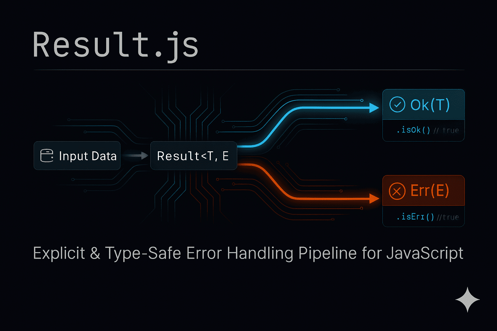

# Result.js — Tipo Result Inspirado em Rust

[](https://www.npmjs.com/package/@eriveltonsilva/result.js)

[](https://www.typescriptlang.org/)
[](https://www.npmjs.com/package/@eriveltonsilva/result.js)

[](https://opensource.org/licenses/MIT)



**Disponível em:** [English](./README.md) | [Español](./README.es.md)

Um tipo Result leve e inspirado em Rust para Javascript e Typescript. Trate os casos de sucesso e erro explicitamente sem exceções.

## Funcionalidades

- 🦀 **API inspirada em Rust** - Padrão familiar `Result<T, E>`
- 🎯 **Type-safe** - Suporte completo a Typescript com excelente inferência de tipos
- 📦 **Zero dependências** - Leve e focado
- 🔗 **Encadeável** - API fluente com `map`, `andThen` e mais
- ⚡ **Tree-shakeable** - Tamanho de bundle otimizado
- 🛡️ **Sem exceções** - Tratamento seguro de erros sem try-catch

## Início Rápido

### Instalação

```bash
npm install @eriveltonsilva/result.js
```

### Importação

```typescript
// ES6 - Recomendado
import { Result } from '@eriveltonsilva/result.js'

// ES6 - Importação padrão
import Result from '@eriveltonsilva/result.js'

// CommonJS
const { Result } = require('@eriveltonsilva/result.js')
```

### Uso Básico

```typescript
// Criar Results
const sucesso = Result.ok(42)
const erro = Result.err(new Error('Algo deu errado'))

// Verificar e extrair
if (sucesso.isOk()) {
  console.log(sucesso.unwrap()) // 42
}

// Encadear operações
const dobrado = Result.ok(21)
  .map((x) => x * 2)
  .andThen((x) => Result.ok(x + 10))
  .unwrap() // 52

// Padrão matching
const resultado = Result.ok(42).match({
  ok: (valor) => valor * 2,
  err: (erro) => erro.message,
}) // 84

// Tratar erros com segurança
const resultado = Result.fromTry(
  () => JSON.parse('inválido'),
  (erro) => new Error(`JSON inválido: ${erro}`),
) // Error: JSON inválido: SyntaxError: Unexpected token, "inválido" is not valid JSON
```

## Documentação

Para guias abrangentes, referência de API e padrões avançados de uso, consulte a **[documentação completa](https://eriveltondasilva.github.io/result.js)**.

Saiba mais:

- [Início Rápido](https://eriveltondasilva.github.io/result.js/guide/getting-started/quick-start)
- [Exemplos](https://eriveltondasilva.github.io/result.js/examples/patterns)
- [Referência de API](https://eriveltondasilva.github.io/result.js/reference)

## Changelog

Consulte [CHANGELOG.md](./CHANGELOG.md) para uma lista detalhada de mudanças em cada versão.

## Contribuindo

Contribuições são bem-vindas! Por favor, leia nosso [Guia de Contribuição](./CONTRIBUTING.md) para mais detalhes.

## Licença

MIT © [Erivelton Silva](https://github.com/eriveltondasilva)

## Inspiração

Inspirado por:

- [Tipo Result de Rust](https://doc.rust-lang.org/std/result)
- [Tipo Result de Gleam](https://hexdocs.pm/gleam_stdlib/gleam/result.html)
- [oxide.ts](https://www.npmjs.com/package/oxide.ts)
- [result.ts](https://www.npmjs.com/package/result.ts)
